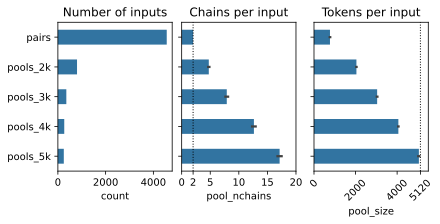
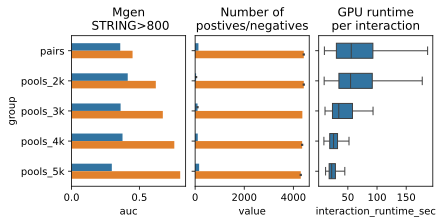

# mgen-pairs-pools
- To study the effect of pooling, we randomly partitioned *M. gen* proteins into five groups. We used the groups to generate all pairwise interactions, and pools of 2k, 3k, 4k and 5k tokens. The pools were sampled naively, there are significantly more overlapping interactions in our pools.
- Pairs and pools were run with AlphaFold v3.0.1 using default settings on A100 GPUs with 80GB memory
    - To speed up the data pipeline steps, we ran MSAs on every protein and used these to generate the corresponding data pipeline input for the multimer prediction step
    - To speed up the structure prediction step, we group inputs by size, and run one structure prediction job per group. This minimizes model startup, recompilation, and job scheduler waiting time.
    - Runtime estimates were parsed from the logs of the prediction step, summing up the reported runtimes for featurising and running model inference.

---
[mgen_pools.tsv](mgen_pools.tsv) pool membership and summary statistics extracted from AlphaFold3 output as follows:
- `name` identifier used throughout AlphaFold3 to identify input/output files (generated by hashing `chain_ids`)
- `group` whether this is a pair or a pool+size of the pool: `pairs`, `pools_2k`, `pools_3k`, `pools_4k`, `pools_5k`
- `pool_nchains` number of chains in the pool
- `pool_size` number of total tokens/residues in the pool
- `chain_ids` uniprot id-s for the individual chains in the pool (converted to lowercase for AlphaFold3)
- `fraction_disordered`, `has_clash`, `iptm`, `ptm`, `ranking_score`, `chain_iptm`, `chain_pair_iptm`, `chain_pair_pae_min`, `chain_ptm` summary stats extracted from the best-ranking model (`..._summary_confidences.json`)
    - Columns starting with `model0_...` to `model4_...` as above, but for one specific model from the top 5 output by AlphaFold3 (e.g. `seed-4_sample-4/summary_confidences.json` for worst-ranking model) 

[mgen_pools.ipynb](mgen_pools.ipynb) plots the number of pools per group, and pool sizes (number of chains, total residues)

---
[mgen_runtimes.tsv](mgen_runtimes.tsv) runtimes for the predictions step for (most) pools:
- `name` identifier used throughout AlphaFold3 to identify input/output files (as above)
- `pool_size` number of total tokens/residues in the pool
- `runtime_sec` runtime estimates for the prediction step (in seconds), these were extracted from the logs output by the prediction step, summing up the reported runtimes for featurising and running model inference

[mgen_runtimes.ipynb](mgen_runtimes.ipynb) plots our prediction step runtimes with a quadratic fit, and DeepMind runtimes from the documentation as a reference

---
[mgen_pairwise.tsv](mgen_pairwise.tsv) interactions-level data separately extracted within each pool (e.g. interactions appearing in multiple pools will have multiple records):
- `name`, `group` from the pool containin the interaction, as above
- `af3_id1`, `af3_id2` uniprot id-s for the interacting proteins (converted to lowercase for AlphaFold3)
- `pair_tokens` total number of residues in the interacting proteins (used in the size-correction)
- `pair_iptm_mean` mean ipTM across top 5 models
- `pair_iptm_mean_corrected` as previous (`pair_iptm_mean`) with applied size correction
- `string_experimental`, `string_combined_score` STRING scores for experimental / combined; 0 if interaction missing in STRING

[mgen_pairwise.ipynb](mgen_pairwise.ipynb) plots the AUCs, number of positive/negative examples, and runtime of the prediction step

